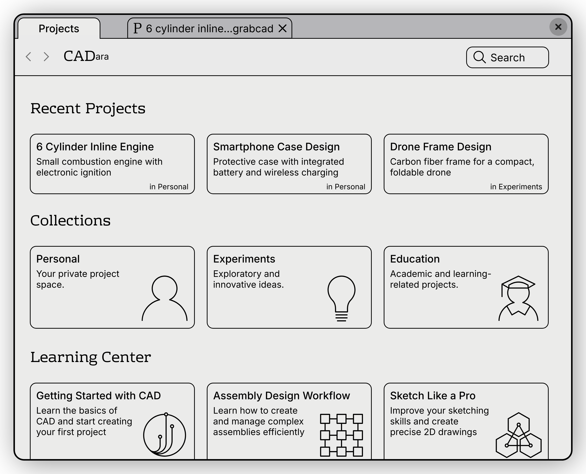
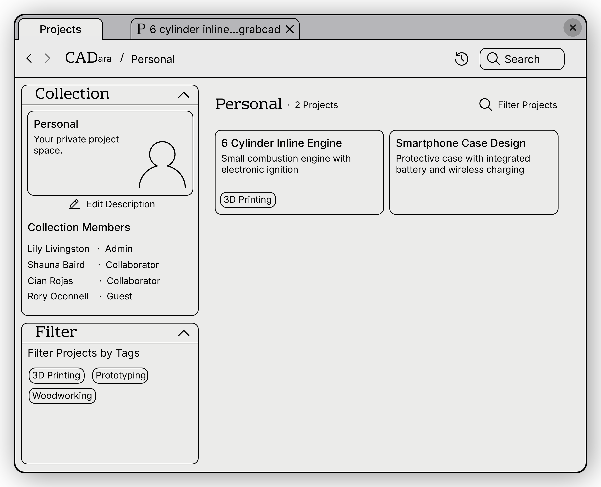
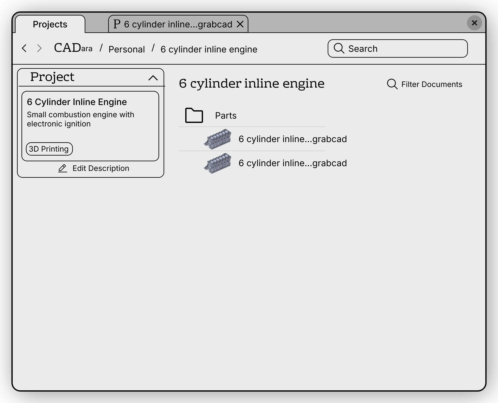
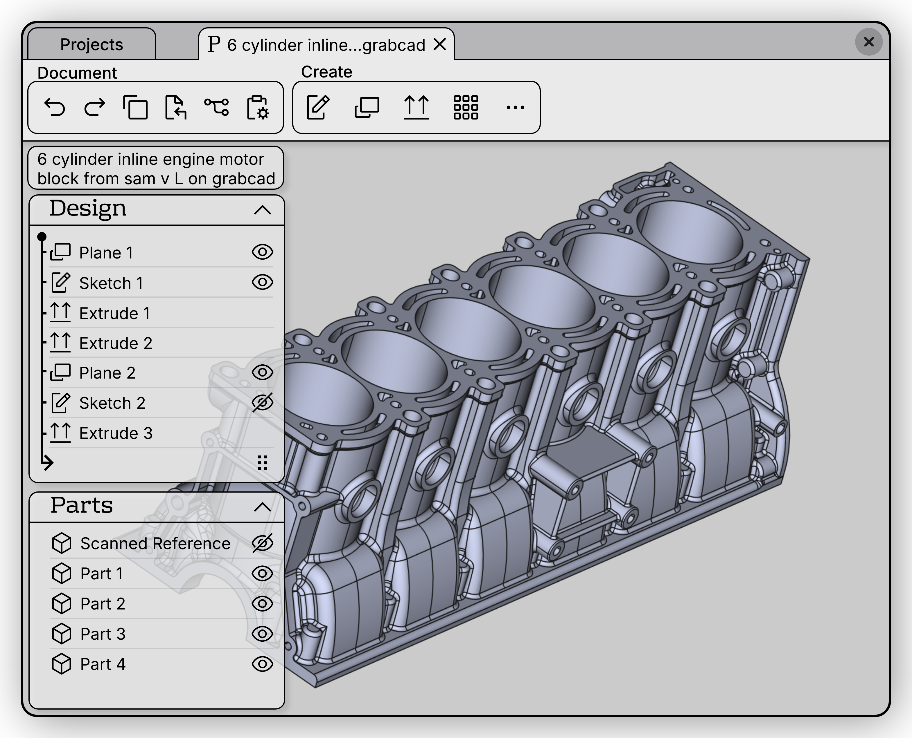
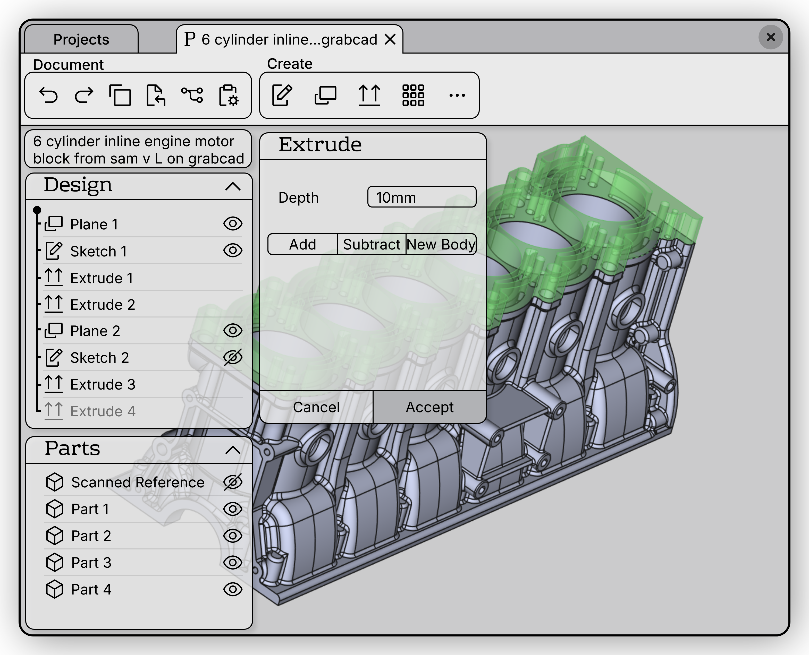

# CADara's Interface Design

The interface is designed to make professional CAD accessible while maintaining the power and flexibility needed for complex projects. Below are the current mockups demonstrating key aspects of the user experience.

## Home View

The home view provides:
- Recent projects with descriptions 
- Collection categories (Personal, Experiments, Education)
- Learning Center with guided tutorials to interactively teach how core concepts work

## Personal Collection 

Collections are groups of projects. Think of them like a personal collection stored on your device and a work collection managed by your team. 
The collection view shows:
- Project cards with descriptions and tags
- Team member management with role-based access 
- Collection description and settings

#### Project Overview

Projects house documents and allow for interlinking references between them. Version control is at the project level. Therefore, assemblies will only work on documents within the same project.
The project overview displays: 
- Project description and metadata
- Document organization in a folder structure
- Preview thumbnails of parts

#### Modeling Interface

The modeling workspace features:
- Feature tree showing design history 
- Parts list to see which components are separate when imported into an assembly
- Context-specific tools to avoid the complexity of understanding workspaces like in CATIA/FreeCAD
- Compact UI optimized for widescreen displays while still allowing potential touchscreen use 
- Large 3D viewport for model manipulation

#### Feature Creation

The feature creation interface shows:
- Prominent UI to avoid situations where a tool is accidentally activated
- Clear operation parameters (e.g., extrude depth) 
- Operation mode selection (Add/Subtract/New Body)
- Real-time preview with transparency
- Accept/Cancel confirmation

> Note: These mockups represent the design direction for CADara and may evolve during development.